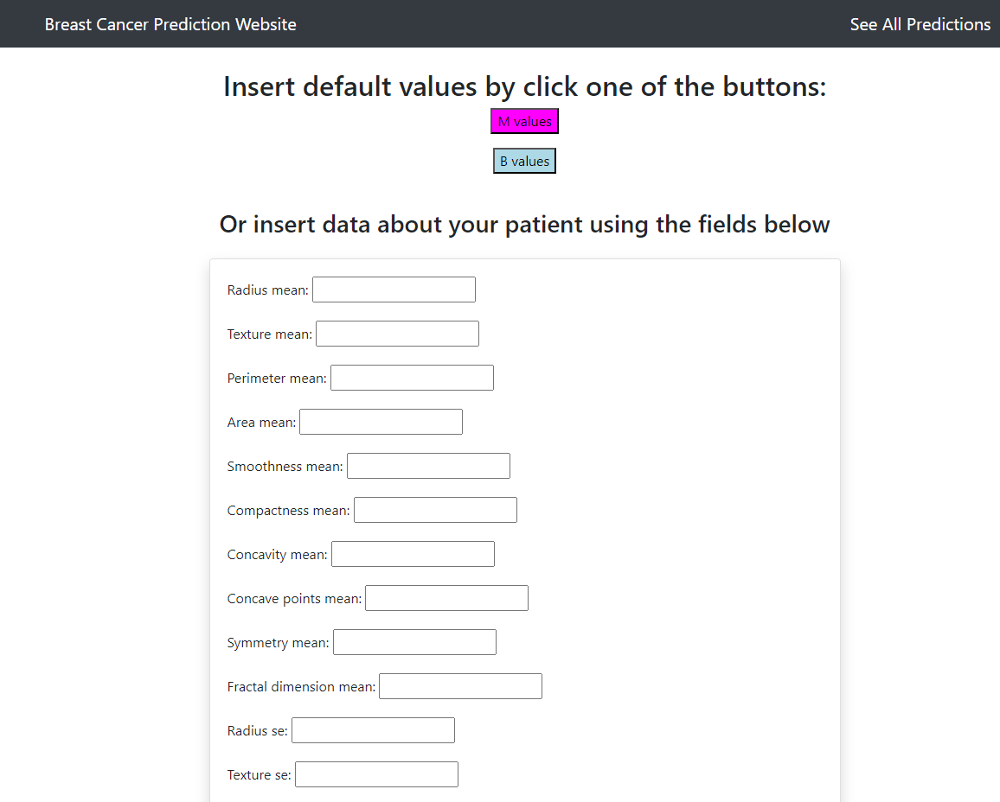
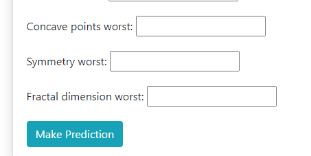
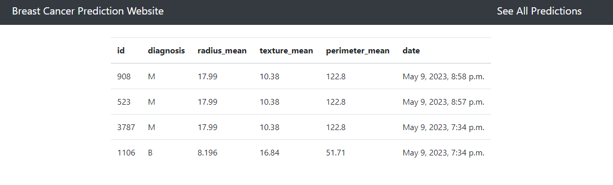
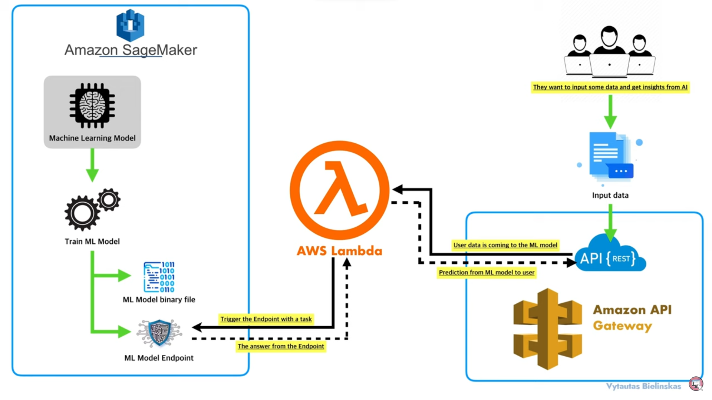

# Introduction

The goal of this project is to deploy and run a Machine Learning algorithm in the AWS cloud. The dataset was downloaded
from Kaggle. Machine Learning model (Neural Network) is created, trained and tested in the AWS cloud.
The model is saved in the cloud using the S3 bucket. 
The model is deployed in the cloud and accessible via this web application. 

# Live demo
Check out the [live demo](http://krzysztofnazar.pythonanywhere.com/) of this project hosted with Pythonanywhere.

This project is written with Django 4.0.8 and Python 3.

# User interface
This is the home page, where user can insert 30 parameters about the patient:

When ready, the user clicks the button "Make prediction" which sends request to AWS Cloud:

The user can see all predictions saved in the database. Only several columns (out of 32) are visible in this page:

### Main features

* Predictions of breast cancer based on 30 parameters with more than 96% of accuracy

* Bootstrap static files included

* Separated requirements files (requirements.txt)

* SQLite3 database

* Two buttons to fill out the form quickly

# Usage

To use this template to start your own project:

### Existing virtualenv

If your project is already in an existing python3 virtualenv first install django by running

    $ pip install django
    
And then run the `django-admin.py` command to start the new project:

    $ django-admin.py startproject \
      --template=https://github.com/KrzysztofNazar01/Machine-Learning-Django-With-AWS-Cloud-Services \
      --extension=py,md \
      Machine-Learning-Django-With-AWS-Cloud-Services
      
### No virtualenv

This assumes that `python3` is linked to valid installation of python 3 and that `pip` is installed and `pip3`is valid
for installing python 3 packages.

Installing inside virtualenv is recommended, however you can start your project without virtualenv too.

If you don't have django installed for python 3 then run:

    $ pip3 install django
    
And then:

    $ python3 -m django startproject \
      --template=https://github.com/KrzysztofNazar01/Machine-Learning-Django-With-AWS-Cloud-Services \
      --extension=py,md \
      Machine-Learning-Django-With-AWS-Cloud-Services
      
      
After that just install the local dependencies, run migrations, and start the server.

# Machine Learning Django With AWS Cloud Services

## Getting Started

First clone the repository from Github and switch to the new directory:

    $ git clone git@github.com/KrzysztofNazar01/Machine-Learning-Django-With-AWS-Cloud-Services.git
    $ cd Machine-Learning-Django-With-AWS-Cloud-Services
    
Activate the virtualenv for your project.
    
Install project dependencies:

    $ pip install -r requirements.txt
    
    
Then simply apply the migrations:

    $ python manage.py migrate
    

You can now run the development server:

    $ python manage.py runserver

# AWS Architecture
In the image below, you can see how the AWS architecture is designed.

Image source: https://www.youtube.com/watch?v=stD47vPDadI&t=805s&ab_channel=DataScienceGarage

## How does it work?
It can be explained step by step starting form the client side:
1. A client script calls an Gateway API action and passes parameter values.
2. API Gateway is a layer that provides the API to the client. In addition, it seals the backend so that AWS Lambda stays and runs in a protected private network. API Gateway passes the parameter values to the Lambda function. 
3. The Lambda function parses the value and sends it to the SageMaker model endpoint.
4. The model performs the prediction and returns the predicted value to Lambda.
5. The Lambda function parses the returned value and sends it back to API Gateway.
6. API Gateway responds to the client with that value.

## Services
### AWS SageMaker:
- create, train and test the ML model with Jupyter Notebook
- deploy a trained and validated ML model as an online endpoint
### AWS Lambda function:
- calls the SageMaker runtime invoke_endpoint
- lambda function adjusts the returned prediction value by the model
### AWS Gateway API:
- REST API
- created a POST method to target the requests from used to Lambda function
### AWS S3:
- save the imported dataset as a CSV file
- store training and validation data as well as the trained model
### EC2 Instance:
- host the model (host the endpoint)

## Machine Learning model:
I used Breast Cancer Prediction.ipynb (from the SageMaker Examples)
Model is trained on the breast cancer dataset (569 rows, 32 columns)
Dataset is randomly shuffled and divided into 3 parts: 
80% training, 10% validation, 10% testing
The trained model was tested on the test data:
Prediction Accuracy: 96.2 %, Baseline Accuracy: 66.0 %

# Lessons learned
- Don't leave unused resources running. For example turn off notebooks in AWS SageMaker when you don't need them - you can still send requests to the Endpoint and get the prediction results
- Monitor your billing. You can create a billing alarm to monitor your estimated AWS charges. AWS will notify you when your bill is greater than XXX USD.
- Check which region are you using (some regions may have different services available)
- Before starting the implementation, do a broad research about possible solutions and services you can use

# Want to read more?
You can follow this links to learn more about solutions used in this project:
- https://aws.amazon.com/blogs/machine-learning/call-an-amazon-sagemaker-model-endpoint-using-amazon-api-gateway-and-aws-lambda/ 
- https://www.kaggle.com/datasets/uciml/breast-cancer-wisconsin-data  
- https://www.youtube.com/watch?v=stD47vPDadI&t=805s&ab_channel=DataScienceGarage 
- https://www.youtube.com/watch?v=EgmWQS1tow4&ab_channel=SkillCurb 
- https://www.youtube.com/watch?v=R1qVqAZfPes&ab_channel=mikegchambers 
- https://dzone.com/articles/troubleshooting-http-502-bad-gateway-in-aws-ebs 
- https://docs.aws.amazon.com/AmazonCloudWatch/latest/monitoring/monitor_estimated_charges_with_cloudwatch.html
- https://aws.amazon.com/architecture/icons/ 
- https://docs.aws.amazon.com/elasticbeanstalk/latest/dg/create-deploy-python-django.html 

